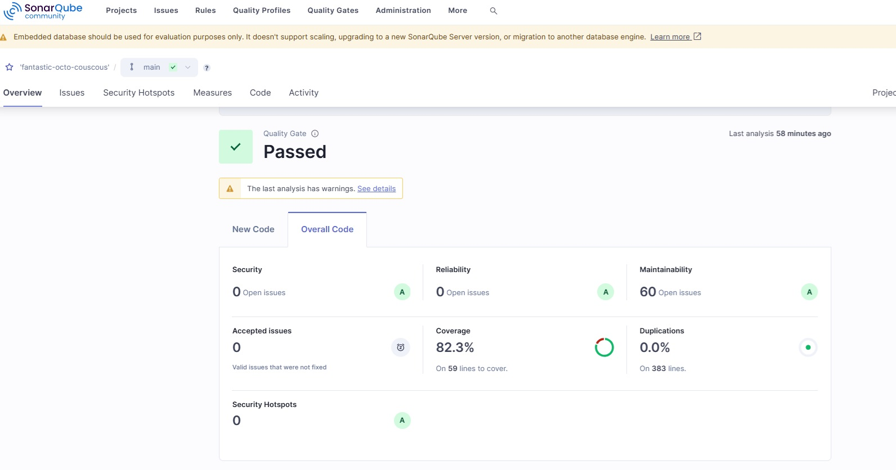

# Awesome fantastic-octo-couscous [](https://awesome.re)

> Esse Projeto é o desenvolvimento de um teste que me foi aplicado em 17/02/2025.

<!--lint disable awesome-toc-->
## Regras de negocio

Devemos prover os seguintes modelos de seguros:

- Seguro Básico. Valor: 2% do valor do veículo 
- Seguro Parcial. Valor: 3% do valor do veículo
- Seguro Total. Valor: 4% do valor do veículo

|                              | Seguro Básico | Seguro Parcial | Seguro Total |
|------------------------------|---------------|:--------------:|--------------|
| Veículo <= 70.000            | Sim           |   Sim\*\*\*    | Não          |
| Veículo > 70.000 e < 100.000 | Sim           |    Sim\*\*     | Não          |
| Veículo => 100.000           | Sim           |     Sim\*      | Sim          |

- \* Clientes com menos de 30 anos
- \*\* Clientes que residem em SP
- \*\*\* Clientes com menos de 30 anos que residem em SP

## A aplicação deve receber como entrada essas informações:


```console
{
  "customer": {
    "name": "João",
    "cpf": "123.456.789-10",
    "age": 29,
    "location": "BH",
    "valor_veiculo": 70000
  }
}
```


## E deve responder essas informações:


```console
{
  "customer": {
    "name": "João",
    "insurances": [
      {
        "type": "basic",
        "cost": 2
      }
    ]
  }
}
```

## Abaixo Explicarei como é feita a chamada para a aplicação


- É só realizar uma chamada para:
  
```console
localhost:8080/valuation/test
```
- Contendo o JSON que desejar exemplo:
```console
{
  "customer": {
    "name": "João",
    "cpf": "123.456.789-10",
    "age": 29,
    "location": "BH",
    "valor_veiculo": 70000
  }
}
```
- A resposta devera conter:
```console
{
    "customer": {
        "name": "João"
    },
    "insurances": [
        {
            "type": "basic",
            "cost": 2
        }
    ]
}
```

- A collection do Postman esta no arquivo (enviado por Email):
```console
TesteCollection.postman_collection
```
  


## Abaixo Explicarei como foram tratados os pontos de atenção:

Meus conhecimentos de docker fora do Devops são basicos, porem consegui desenvolver uma aplicação funcional que acredito que atenda todos os requisitos! 

- Abstração, acoplamento, extensibilidade e coesão
  - Foi utilizado herança nas classes que fazem requisição e resposta para evitar duplicidade de Codigo:
  - Utilizei variaveis de ambiente no application.yaml para que a aplicação possa ser parametrizada de forma dinamica (tentei as variaveis de ambiente do docker-compose, porem sem sucesso)
  - Foram utilizados enumerações que facilitam a chegada de novas regras de negocio e tambem abstraem parte do codigo
  
 

- Utilização de Design Patterns
  - utilizei uma classe de negocios foi o lugar onde vi que seria necessario organização, ja que não temos repositorys, services...
  - Não usei builders, mas deveria, fiquei com medo de erros com construtores e tambem cobertura de codigo!
 

- Legibilidade de Código
  - inclui comentarios nas regras onde explico como organizei os parametros da aplicação
  - Codigo possui boa identação, mas sempre podemos melhorar
 

- Tratamento de Erros
  - tem um pequeno tratamento de erros na controller onde eu mostro possiveis erros.

- Dockerfile configurado para deploy da aplicação
  - Meu Dockerfile faz o basico para uma applicação ser executada porem não consegui resolver o host então ele devera ser executado com o comando:
```console
docker run -it -p 8080:8080 app
```

- Geração do relatório de cobertura de testes
  - Foram feitos todos os testes unitarios cobrindo mais de 80% da aplicação
    


- Foi a forma mais simples que encontrei de gerar uma cobertura (acredito que em ambientes corporativos eu poderia cair em varias Rules porem quis simplificar)


  
  
### Como executar o sonar do projeto

- Fiz usando a imagem do sonar community
  - ela deve ser baixada e executada da seguinte forma 

```console
docker run --name sonarqube-custom -p 9000:9000 sonarqube:community
```

- apos criar um usuario e gerar um token devera ser executado o Maven utilizando o seguinte comando (onde a chave deve ser colocada no ultimo parametro:

```console
mvn clean verify sonar:sonar -Dsonar.projectKey=fantastic-octo-couscous -Dsonar.projectName='fantastic-octo-couscous' -Dsonar.host.url=http://localhost:9000 -Dsonar.token=<CHAVE GERADA>
```

- Observabilidade
  - Utilizei Log4j de forma muito simples e singela
  - Realizo print de alguns dados que não são sensiveis e ajudam na rastreabilidade
  - É mostrado o tempo de execução da aplicaçõo
  - tenho conhecimentos em Logstash, elastic search, grafana, kibana (até pensei em criar uma imagem utilizando porem é uma coisa que levaria tempo e não sei o quanto seria relevante)

- Testes de unidade e integração
  - Foi utilizado testes simples de mockito
  - Sei que DTO's não são necessarios para cobertura (porem estava inspirado e criei uma fabrica de mocks para abstrair a massa)
  - Utilizei Cocumber para realizar o teste integrado da controller 

- Testes de unidade e integração
  - Foi utilizado testes simples de mockito
  - Sei que DTO's não são necessarios para cobertura (porem estava inspirado e criei uma fabrica de mocks para abstrair a massa)
  - Utilizei Cocumber para realizar o teste integrado da controller 

- Padrões REST
  - Utilizei tratamento de erros e HttpStatus
  - Queria muito usar GET, a maioria das arquiteturas obrigam (porem o cucumber não curte usar body em GET e ele estava rodando tão bonitinho)
 
### Arquitetura utilizada

- Foi utilizado SpringBoot dentro de um container Docker
  [`Link DockerHub`](https://hub.docker.com/r/lucasalexandre1990/testelucas/tags)
  
- com testes utilizando Mockito
- testes de integração utilizando Cucumber
- Sonar para relatorio de testes
- GitHub para versionamento [`Link GitHub`](https://github.com/lucasAlexandre/fantastic-octo-couscous.git)


  
